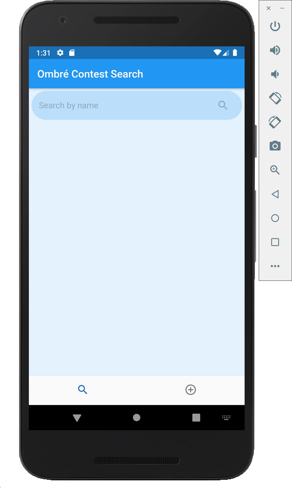
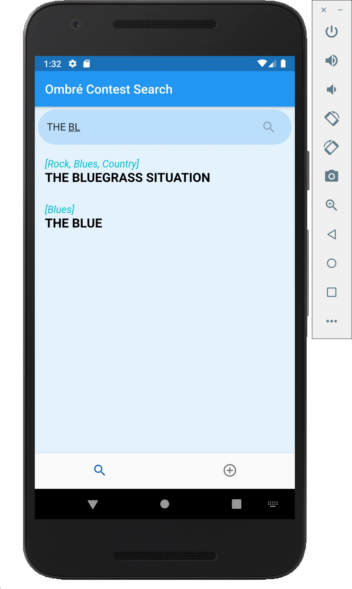
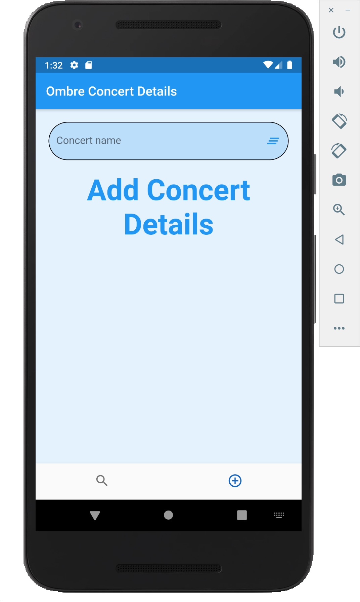

## SearchBar Flutter App
A Flutter Application to implement Search functionaltiy in the code
## Getting Started
A few resources to get you started if this is your first Flutter project:

- [Lab: Write your first Flutter app](https://flutter.dev/docs/get-started/codelab)
- [Cookbook: Useful Flutter samples](https://flutter.dev/docs/cookbook)

For help getting started with Flutter, view our
[online documentation](https://flutter.dev/docs), which offers tutorials,
samples, guidance on mobile development, and a full API reference.

## Setup?
#### Prerequisites
1. Installed flutter sdk
2. Correct Path Variables

```
1. Clone repository
2. Run get dependencies (Android studios)
3. Run on your device/emulator
```
#### The Project Structure

This project contains 2 pages
1. To add the concert details automatically
2. To display the search results based on the data stored in the firestore database


## The screenshots:




## The apk of the app is stored in the folder

https://drive.google.com/drive/folders/1GgsHud1JFR8yS37lDiQgyPBlTOAYVODB?usp=sharing

## Technologies Used:
<p>
 

</p>

## Having Issues
This project uses [GitHub Issues](https://github.com/ShirshaDatta/Connects-2/issues) for tracking bugs and feature requests, so feel free to open one if you find any :)

<br />

<div align="center">

##### Made By Daksh Sanjay Malik

</div>